# End-to-End Java CI/CD Pipeline

## 1. Project Overview

### Overview

This project demonstrates the implementation of a production-style end-to-end Continuous Integration and Continuous Deployment (CI/CD) pipeline for a Java web application using a Jenkins Freestyle Job.

The solution integrates GitHub for source code management, Jenkins for build automation, Maven for project build and packaging, SonarQube for static code analysis, Nexus Repository Manager for artifact storage, Apache Tomcat for application deployment, Nginx as a reverse proxy, and Slack for build notifications.

The pipeline is automatically triggered by a GitHub Webhook whenever changes are pushed to the repository. Jenkins retrieves the latest source code, executes a Maven build, performs static code analysis with SonarQube, publishes the generated WAR artifact to Nexus Repository, deploys the application to Apache Tomcat, exposes the application through an Nginx reverse proxy, and sends build status notifications to Slack.

## 2. Solution Architecture

### 2.1 Architecture Diagram

The solution consists of four Amazon EC2 instances, each hosting a dedicated component of the CI/CD pipeline. Jenkins orchestrates the complete workflow, including source code retrieval, application build, code quality analysis, artifact publication, application deployment, reverse proxy configuration, and build notifications.

The pipeline integrates GitHub, Jenkins, Maven, SonarQube, Nexus Repository Manager, Apache Tomcat, Nginx, and Slack into a single automated workflow for building and deploying a Java web application.

**Architecture Diagram**

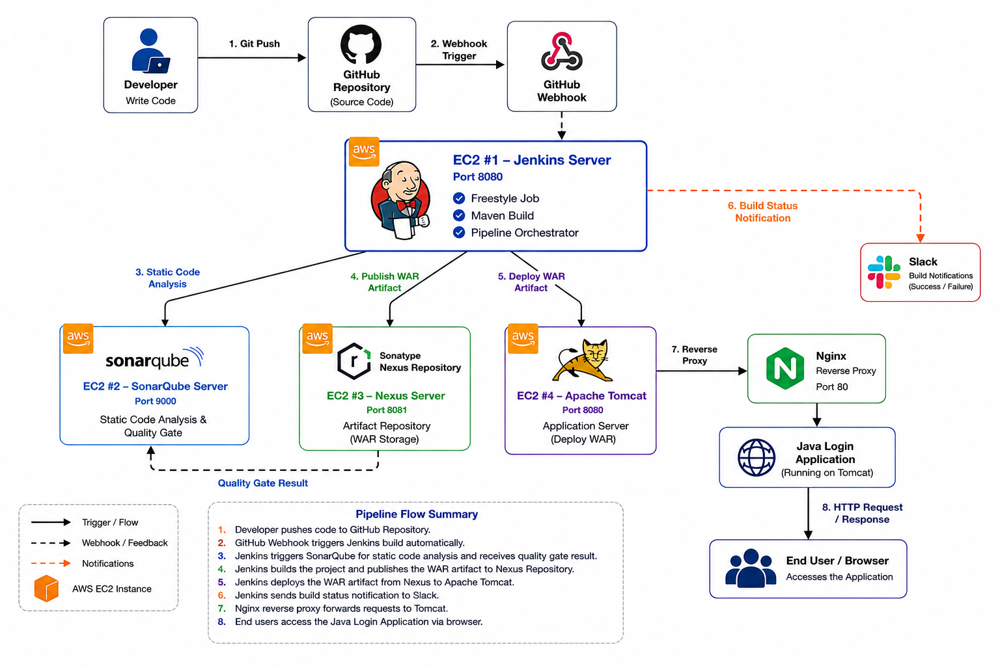

### 2.2 Infrastructure Overview

The implementation consists of four dedicated Amazon EC2 instances deployed within AWS.

| Server | Purpose |
|---------|---------|
| **Jenkins Server** | Hosts Jenkins and orchestrates the CI/CD pipeline using a Jenkins Freestyle Job. |
| **SonarQube Server** | Performs static code analysis. |
| **Nexus Repository Server** | Stores versioned WAR artifacts generated during the build process. |
| **Apache Tomcat Server** | Hosts the Java web application behind an Nginx reverse proxy. |

The deployment workflow begins with a Git push to GitHub. A GitHub Webhook triggers the Jenkins Freestyle Job, which builds the application with Maven, performs code analysis using SonarQube, publishes the generated WAR artifact to Nexus Repository, deploys the application to Apache Tomcat, and sends build notifications to Slack.

### 2.3 Technology Stack

| Category | Technology |
|----------|------------|
| Source Code Management | GitHub |
| Continuous Integration | Jenkins Freestyle Job |
| Build Tool | Apache Maven |
| Code Quality Analysis | SonarQube |
| Artifact Repository | Nexus Repository Manager |
| Application Server | Apache Tomcat 9 |
| Reverse Proxy | Nginx |
| Notifications | Slack |
| Cloud Platform | Amazon EC2 |
| Operating System | Ubuntu Server 24.04 LTS |
| Programming Language | Java 11 |
| Build Artifact | WAR |

## 3. CI/CD Workflow

### 3.1 Jenkins Server Provisioning

#### Overview

Jenkins serves as the central automation server for the CI/CD pipeline. It orchestrates source code retrieval, application build, static code analysis, artifact publication, application deployment, and Slack notifications through a Jenkins Freestyle Job.

#### Implementation

The Jenkins server was provisioned using the [`scripts/jenkins.sh`](scripts/jenkins.sh) installation script included in this repository. The script installs Jenkins, configures the required dependencies, enables the Jenkins service, and starts the server.

Following installation, Jenkins was configured with the required plugins, credentials, build tools, and integrations used throughout the CI/CD pipeline.

#### Validation

Jenkins installation was verified by successfully accessing the Jenkins web dashboard.

**Validation Screenshot**

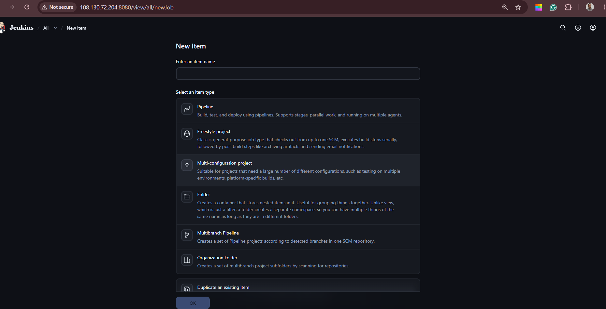

### 3.2 Jenkins Configuration

#### Overview

Jenkins was configured with the build tools required by the CI/CD pipeline through the Global Tool Configuration page.

#### Implementation

The Global Tool Configuration was configured with the required Java Development Kit (JDK) and Apache Maven installations. These tools are referenced by the Jenkins Freestyle Job during the application build and packaging stages.

#### Validation

The configuration was verified through the Jenkins Global Tool Configuration page, confirming that the required JDK and Maven installations were available.

**Validation Screenshot**

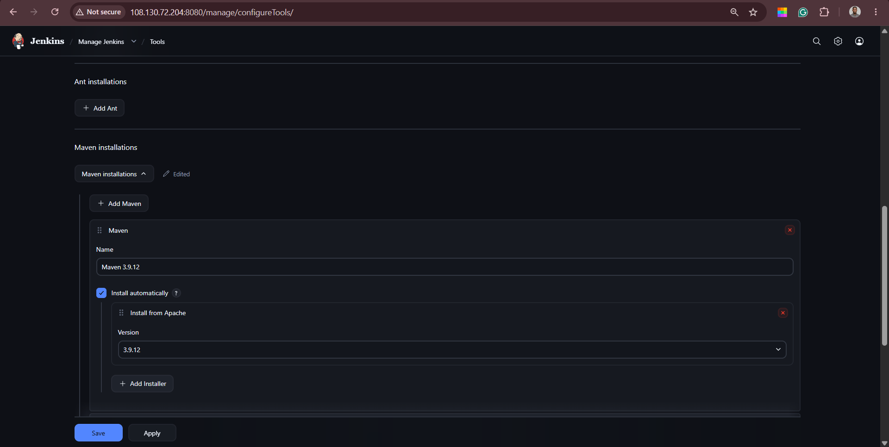

### 3.3 Git Integration

#### Overview

GitHub is used as the source code repository for the project. Jenkins retrieves the application source code directly from the configured GitHub repository during each build.

#### Implementation

The Jenkins Freestyle Job was configured with the GitHub repository URL, branch specification, and Git credentials through the Source Code Management (SCM) configuration.

Authentication between Jenkins and GitHub was configured using a GitHub Personal Access Token (PAT) stored securely in the Jenkins Credentials Store.

#### Validation

The Git integration was validated through the Jenkins Freestyle Job configuration, confirming the repository URL, authentication credentials, branch specification, and Source Code Management (SCM) configuration.

**Jenkins Job Configuration**

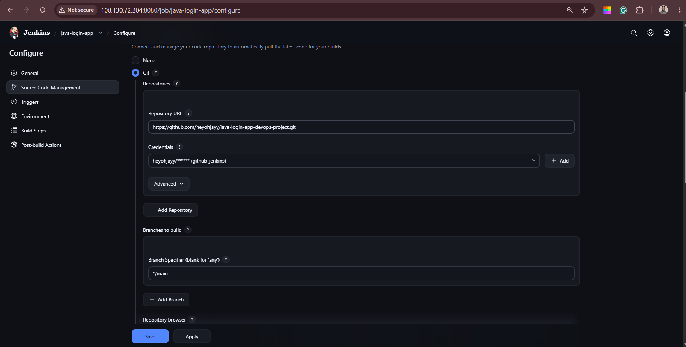

### 3.4 GitHub Webhook

#### Overview

GitHub Webhooks were configured to automatically trigger the Jenkins Freestyle Job whenever changes are pushed to the repository. This enables continuous integration by eliminating the need for manual build execution.

#### Implementation

A GitHub Webhook was configured within the repository to send HTTP POST requests to the Jenkins webhook endpoint whenever a push event occurs. The Jenkins Freestyle Job was configured to accept webhook triggers, allowing builds to start automatically after every successful code push.

#### Validation

Webhook integration was validated by confirming the webhook configuration in GitHub and verifying successful payload delivery to Jenkins.

**Webhook Configuration**

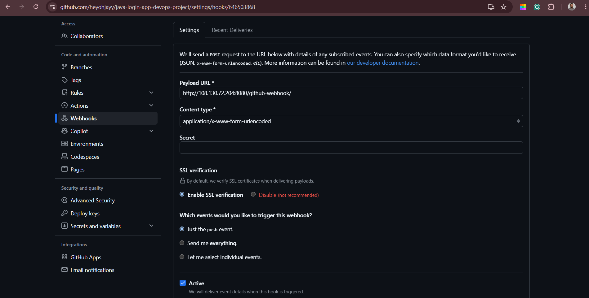

**Webhook Delivery Success**

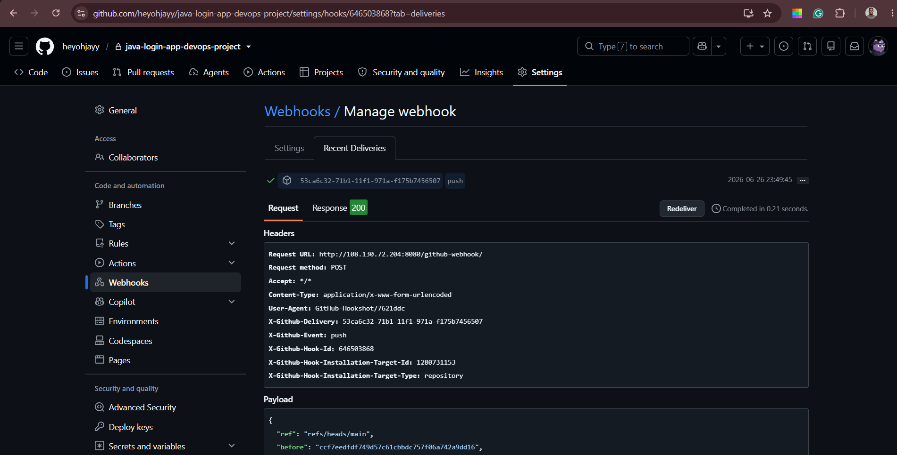

The webhook integration was further validated by confirming that the Jenkins Freestyle Job was automatically triggered by a GitHub push event.

**Automatic Build Trigger**

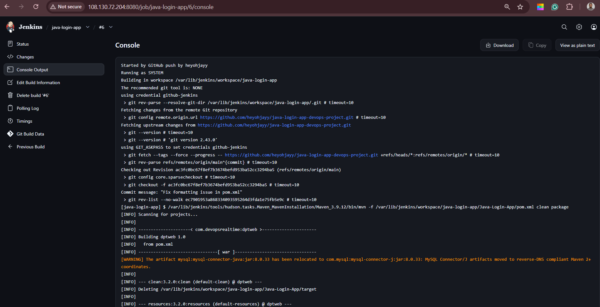

The webhook-triggered build completed successfully, confirming successful execution of the Maven build process.

**Maven Build Success**

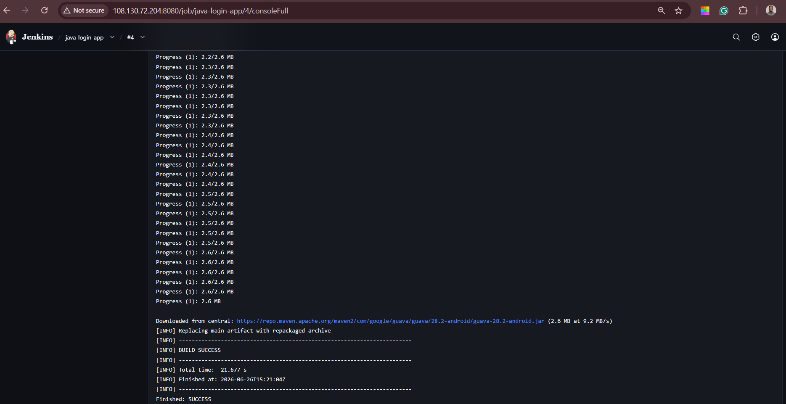

### 3.5 SonarQube Server Provisioning

#### Overview

A dedicated SonarQube server was provisioned to perform static code analysis as part of the CI/CD pipeline.

#### Implementation

The SonarQube server was provisioned using the [`scripts/sonarqube.sh`](scripts/sonarqube.sh) installation script included in this repository. The script installs SonarQube, configures the required runtime dependencies, enables the service, and prepares the server for integration with Jenkins.

#### Validation

The installation was verified by successfully accessing the SonarQube dashboard through a web browser.

**Validation Screenshot**

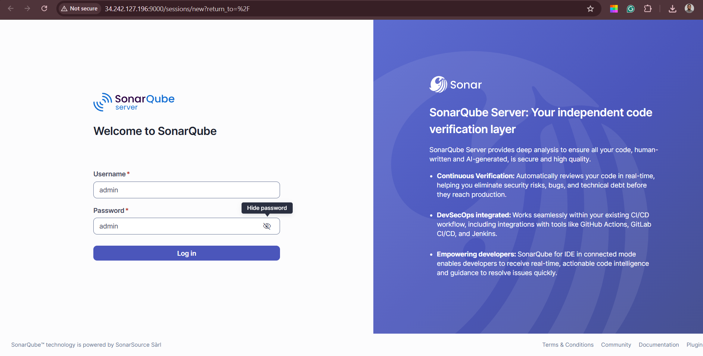

### 3.6 SonarQube Integration

#### Overview

SonarQube was integrated with Jenkins to perform automated static code analysis during every pipeline execution.

#### Implementation

A SonarQube Scanner installation and authentication token were configured within Jenkins to establish communication with the SonarQube server. The Jenkins Freestyle Job executes the SonarQube scan during the build process, publishing the analysis results to the configured SonarQube project.

#### Validation

The integration was validated by confirming successful project analysis and Quality Gate evaluation within the SonarQube dashboard.

**Quality Gate**

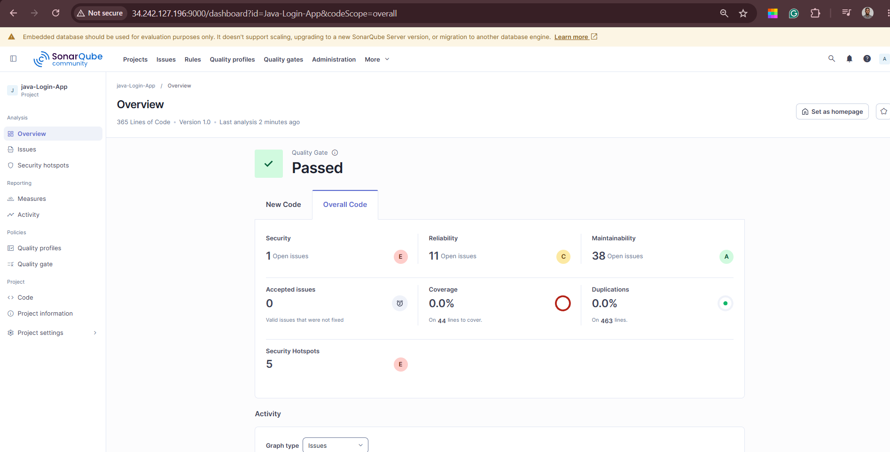

### 3.7 Nexus Server Provisioning

#### Overview

A dedicated Nexus Repository Manager server was provisioned to provide centralized storage and version management for build artifacts generated during the CI/CD pipeline.

#### Implementation

The Nexus Repository server was provisioned using the [`scripts/nexus.sh`](scripts/nexus.sh) installation script included in this repository. The script installs Nexus Repository Manager, configures the required runtime environment, enables the service, and prepares the repository manager for artifact storage.

#### Validation

The installation was verified by successfully accessing the Nexus Repository Manager web interface.

**Validation Screenshot**

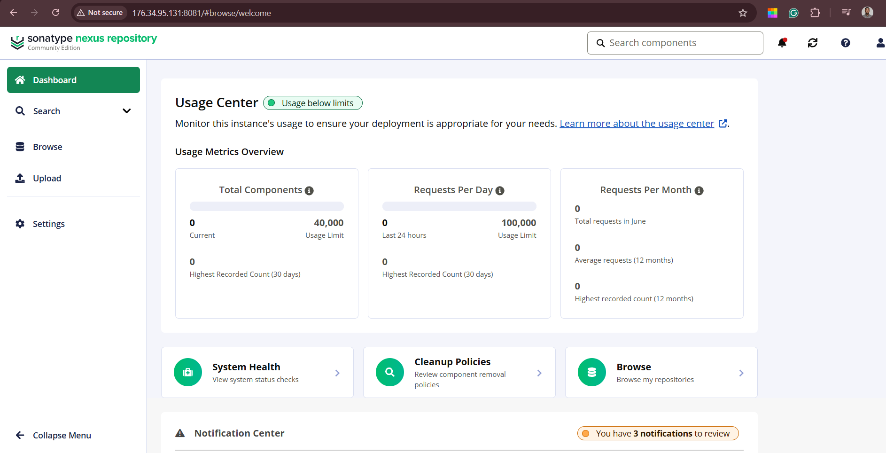

### 3.8 Nexus Integration

#### Overview

Nexus Repository Manager was integrated with Jenkins to store versioned WAR artifacts generated during the Maven build process.

#### Implementation

A hosted Maven repository was created within Nexus Repository Manager, and the project `pom.xml` was configured with the appropriate distribution management settings. Jenkins was configured to publish the generated WAR artifact to the Nexus repository as part of the build process.

#### Validation

The integration was validated by confirming the successful publication of the generated WAR artifact within the configured Nexus repository.

**Artifact Deployment**

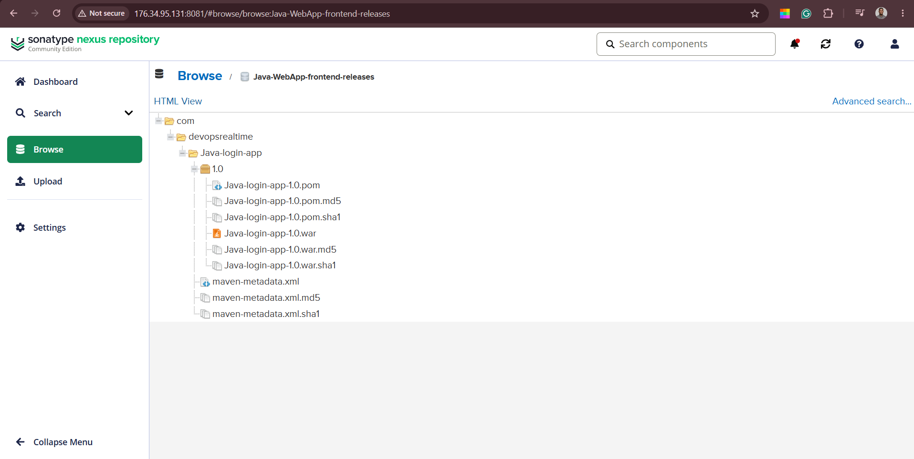

### 3.9 Tomcat Server Provisioning

#### Overview

A dedicated Apache Tomcat server was provisioned to host the deployed Java web application.

#### Implementation

The Tomcat server was provisioned using the [`scripts/tomcat.sh`](scripts/tomcat.sh) installation script included in this repository. The script installs Apache Tomcat, configures the required users and deployment settings, enables the Tomcat service, and prepares the server to receive deployments from Jenkins.

#### Validation

The installation was verified by successfully accessing the Apache Tomcat Manager application.

**Validation Screenshot**

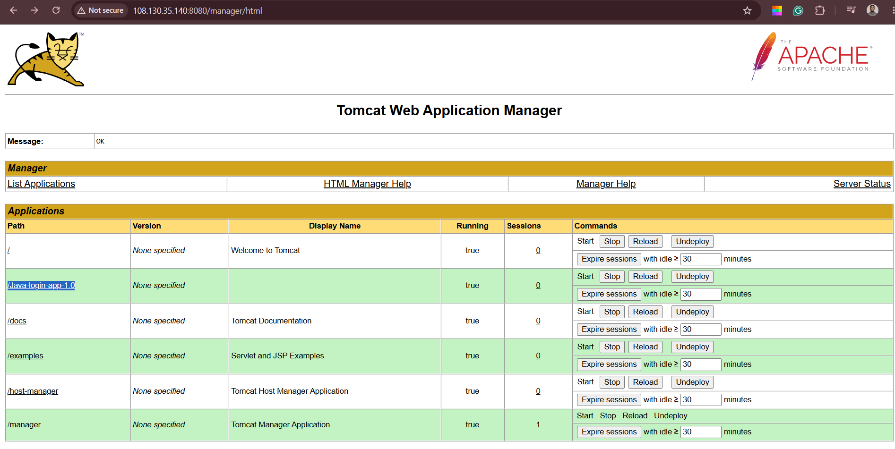

### 3.10 Apache Tomcat Deployment

#### Overview

Jenkins was configured to automatically deploy the generated WAR artifact to the Apache Tomcat server after a successful build.

#### Implementation

The Deploy to Container plugin was configured within the Jenkins Freestyle Job using the Tomcat Manager credentials and deployment endpoint. Upon a successful Maven build, Jenkins deploys the generated WAR artifact directly to the configured Apache Tomcat server.

#### Validation

The deployment was verified through the Apache Tomcat Manager application, confirming that the Java web application was successfully deployed and running.

**Deployment Verification**

### 3.11 Nginx Reverse Proxy

#### Overview

Nginx was configured as a reverse proxy to provide a single HTTP entry point for the deployed Java web application hosted on Apache Tomcat.

#### Implementation

The Nginx server was provisioned using the [`scripts/nginx.sh`](scripts/nginx.sh) installation script included in this repository. The reverse proxy configuration was defined in [`configuration/nginx.conf`](configuration/nginx.conf), forwarding incoming HTTP requests on port 80 to the Apache Tomcat application running on port 8080.

#### Validation

The reverse proxy configuration was verified by confirming the Nginx configuration and successfully accessing the deployed Java web application through the browser.

**Reverse Proxy Configuration**

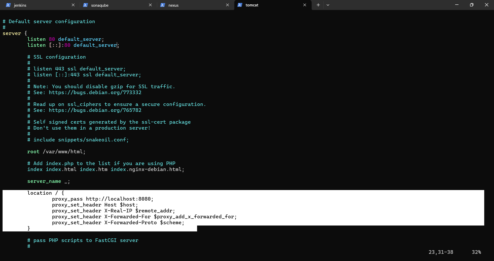

**Browser Validation**

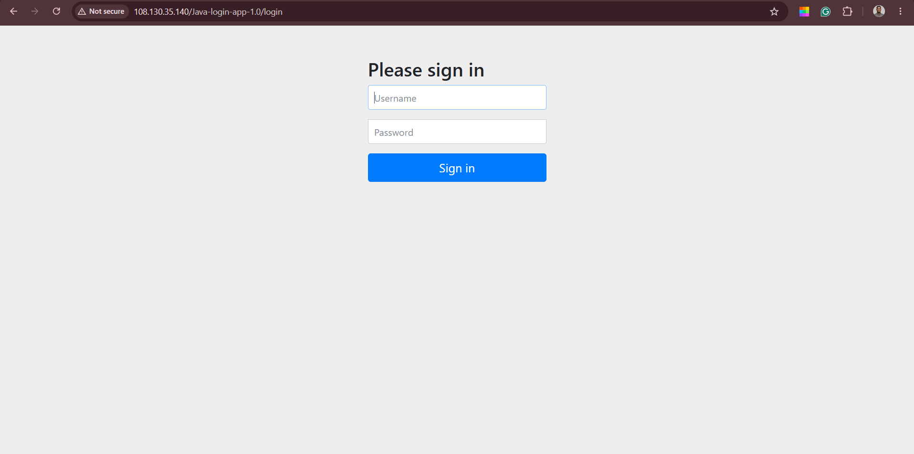

### 3.12 Slack Notifications

#### Overview

Slack was integrated with Jenkins to provide real-time build notifications for the Jenkins Freestyle Job.

#### Implementation

A Slack application was created and configured with the required Bot User OAuth Token and permissions. The bot was added to the project workspace and integrated with Jenkins using the Slack plugin. Build notifications were configured within the Jenkins Freestyle Job to send notifications for build start, successful builds, failed builds, jobs not built, and build recovery events.

#### Validation

The integration was verified by successfully receiving automated build notifications in the configured Slack channel after pipeline execution.

**Build Notifications**

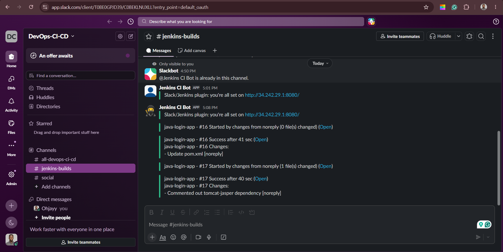
